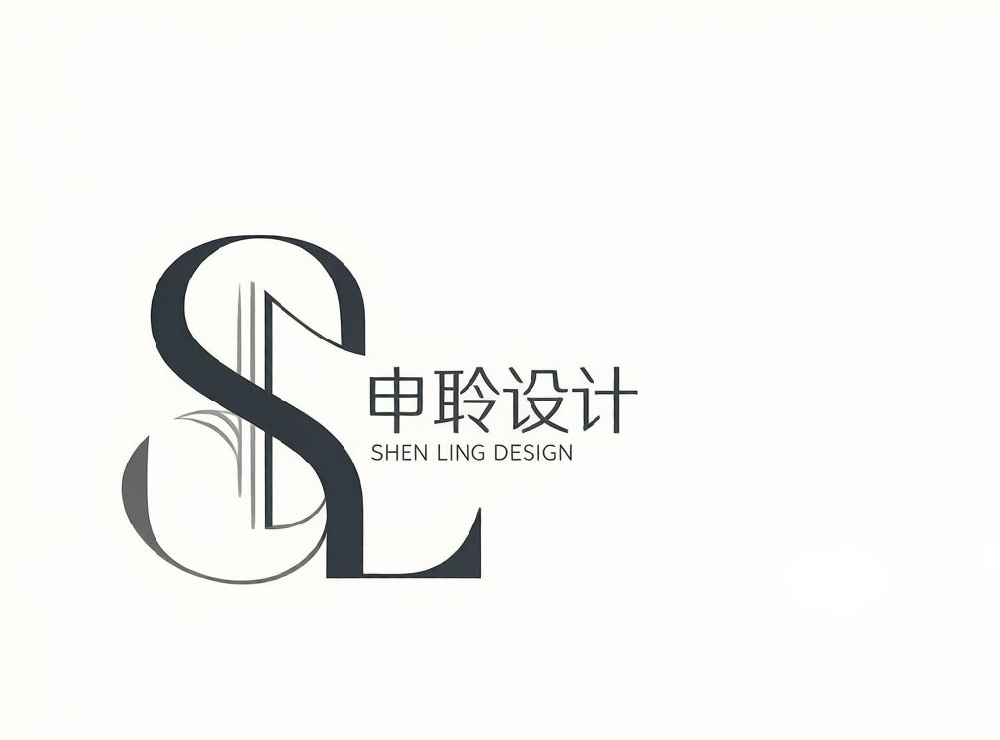
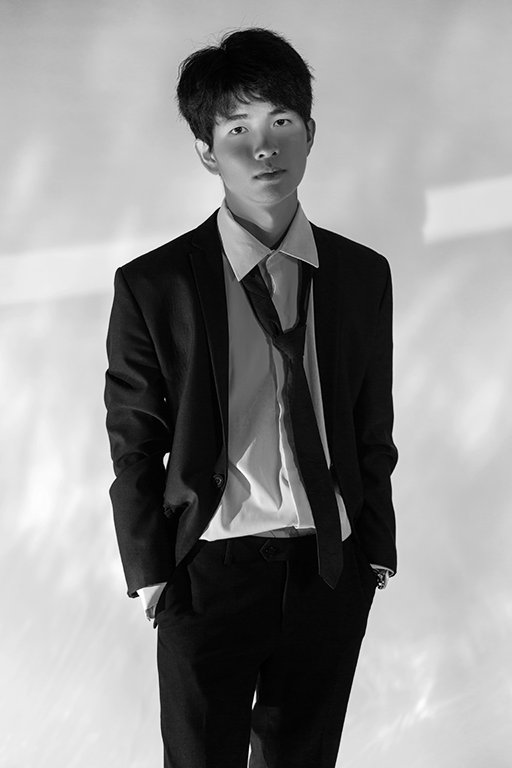

# 个人作品集网站优化方案（完整版）

---

## 一、标题统一修改（全站8个HTML文件）

**当前标题：**
```
SL申聆空间设计丨SL-Studio丨私宅设计丨定制设计
```

**修改为：**
```
TheCharon丨郭校伸丨室内设计师
```

**Meta标签修改：**
```html
<!-- 当前 -->
<meta name="description" content="SL-Studio申聆空间设计，专注别墅豪宅、私人公寓、商业空间设计。8年私宅设计经验...">
<meta name="keywords" content="上海室内设计,申聆空间设计,SL-Studio...">

<!-- 修改为 -->
<meta name="description" content="郭校伸，独立室内设计师，8年私宅设计经验。专注别墅设计、公寓改造、商业空间设计。聆听业主声音，打造独一无二的空间美学。">
<meta name="keywords" content="室内设计师,郭校伸,上海设计师,金山装修,别墅设计,公寓设计">
```

---

## 二、首页 index.html

### Logo区域
```html
<!-- 当前 -->


<!-- 修改为 -->

```

### 首页描述文案
```html
<!-- 当前 -->
<div class="block one-fourth" style="float:left" id="desc">
    SL-Studio申聆空间设计，专注私宅设计。我们聆听每一位业主的声音，以优雅的姿态、舒适的体验为核心，追求恰到好处的设计。让每个空间都独一无二，兼具美感与实用，为您打造专属的生活美学。
    ...
</div>

<!-- 修改为 -->
<div class="block one-fourth" style="float:left" id="desc">
    我是郭校伸，独立室内设计师。8年私宅设计经验，专注别墅设计、公寓改造与商业空间规划。
    <br><br>
    设计理念：聆听业主声音，以优雅、舒适为核心，追求恰到好处的设计。让每个空间都独一无二，兼具美感与实用。
    <div style="height:1px; border-bottom:1px solid #ededed;margin-top:15px;margin-bottom:20px;"></div>
    <a href="projects.html" class="button">查看更多项目</a>
</div>
```

### 页脚版权
```html
<!-- 当前 -->
<div style="float:left;">© 2026 SL 申聆空间设计. All Rights Reserved.</div>

<!-- 修改为 -->
<div style="float:left;">© 2026 TheCharon 郭校伸设计工作室. All Rights Reserved.</div>
```

---

## 三、关于页面 about.html → 重命名为 about-me.html

### 左侧导航菜单修改
```html
<!-- 当前 -->
<li><a href="about.html" style="color:#333333;border-left:1px solid #333333;">关于我们</a></li>
<li><a href="about.html">公司荣誉</a></li>
<li><a href="founder.html">创始人</a></li>
<li><a href="about.html">设计语言</a></li>

<!-- 修改为 -->
<li><a href="about-me.html" style="color:#333333;border-left:1px solid #333333;">关于我</a></li>
<li><a href="about-me.html">设计理念</a></li>
```

### 正文内容重写
```html
<div id="middle">
    <div style="display:flex; align-items:flex-start; margin-bottom:30px;">
        <div style="width:200px; height:260px; flex-shrink:0; margin-right:40px; overflow:hidden; background:#f5f5f5; border:1px solid #ededed;">
            
        </div>
        <div style="flex:1; padding-top:10px;">
            <h2 style="font-size:24px; color:#222; margin-bottom:10px; font-weight:bold;">郭校伸</h2>
            <p style="font-size:13px; color:#999; margin-bottom:20px; letter-spacing:2px;">THE CHARON · 独立室内设计师</p>
            
            <p style="font-size:14px; color:#444; line-height:1.8; text-align:justify;">
                从业8年，专注私宅设计。擅长别墅豪宅设计、公寓改造、商业空间规划。
                <br><br>
                设计理念：聆听每一位业主的声音，以优雅、舒适为核心，追求恰到好处的设计。让每个空间都独一无二，兼具美感与实用，为您打造专属的生活美学。
            </p>
        </div>
    </div>
    
    <div style="height:1px; background:#ededed; margin:30px 0;"></div>
    
    <h3 style="font-size:18px; color:#222; margin-bottom:20px;">代表作品</h3>
    <ul style="font-size:14px; color:#444; line-height:2;">
        <li>🏡 东郊四季独栋别墅 — 上海浦东</li>
        <li>🏠 合景天悦赋别墅 — 上海松江</li>
        <li>🏢 明月黄金展厅 — 广东茂名</li>
        <li>☕ 禾禾咖啡店 — 上海金山</li>
    </ul>
</div>
```

---

## 四、创始人页面 founder.html → 简化为个人简介

删除团队布局，改为单栏个人介绍：

```html
<div id="middle" style="padding:40px 0;">
    <div style="text-align:center; margin-bottom:40px;">
        
        <h2 style="font-size:28px; color:#222; margin-top:20px; font-weight:bold;">郭校伸</h2>
        <p style="font-size:14px; color:#999; letter-spacing:3px;">THE CHARON · 创始人 & 首席设计师</p>
    </div>
    
    <div style="height:1px; background:#ededed; margin:30px 0;"></div>
    
    <div style="font-size:15px; color:#444; line-height:2; text-align:justify;">
        <p>
            8年室内设计经验，从2018年至今服务超过100个家庭。
        </p>
        <p style="margin-top:15px;">
            擅长将业主的生活习惯、审美偏好融入设计方案，创造既美观又实用的居住空间。
            每一个项目都是独一无二的故事，我用心聆听，精心打磨。
        </p>
        <p style="margin-top:15px;">
            服务理念：优雅、舒适、恰到好处。<br>
            不只是设计一个空间，更是设计一种生活方式。
        </p>
    </div>
    
    <div style="height:1px; background:#ededed; margin:30px 0;"></div>
    
    <div style="display:flex; justify-content:space-around; text-align:center;">
        <div>
            <div style="font-size:32px; color:#222; font-weight:bold;">8+</div>
            <div style="font-size:13px; color:#999;">年设计经验</div>
        </div>
        <div>
            <div style="font-size:32px; color:#222; font-weight:bold;">100+</div>
            <div style="font-size:13px; color:#999;">完成项目</div>
        </div>
        <div>
            <div style="font-size:32px; color:#222; font-weight:bold;">25</div>
            <div style="font-size:13px; color:#999;">代表案例</div>
        </div>
    </div>
</div>
```

---

## 五、事业机会 career.html → 改为服务流程

### 页面标题
```html
<title>TheCharon丨郭校伸丨服务流程</title>
```

### 左侧导航
```html
<li><a href="service.html" style="color:#333333;border-left:1px solid #333333;">服务流程</a></li>
```

### 正文内容
```html
<div id="middle">
    <h2 style="font-size:24px; color:#222; margin-bottom:30px; text-align:center;">服务流程</h2>
    
    <div style="display:flex; justify-content:space-between; margin:40px 0;">
        <div style="text-align:center; width:18%;">
            <div style="width:60px; height:60px; border-radius:50%; background:#222; color:#fff; line-height:60px; margin:0 auto 15px; font-size:24px; font-weight:bold;">1</div>
            <div style="font-size:14px; color:#333; font-weight:bold;">初步沟通</div>
            <div style="font-size:12px; color:#999; margin-top:5px;">微信/电话<br>了解需求</div>
        </div>
        
        <div style="text-align:center; width:18%;">
            <div style="width:60px; height:60px; border-radius:50%; background:#222; color:#fff; line-height:60px; margin:0 auto 15px; font-size:24px; font-weight:bold;">2</div>
            <div style="font-size:14px; color:#333; font-weight:bold;">现场量房</div>
            <div style="font-size:12px; color:#999; margin-top:5px;">实地测量<br>记录细节</div>
        </div>
        
        <div style="text-align:center; width:18%;">
            <div style="width:60px; height:60px; border-radius:50%; background:#222; color:#fff; line-height:60px; margin:0 auto 15px; font-size:24px; font-weight:bold;">3</div>
            <div style="font-size:14px; color:#333; font-weight:bold;">方案设计</div>
            <div style="font-size:12px; color:#999; margin-top:5px;">平面布局<br>效果图呈现</div>
        </div>
        
        <div style="text-align:center; width:18%;">
            <div style="width:60px; height:60px; border-radius:50%; background:#222; color:#fff; line-height:60px; margin:0 auto 15px; font-size:24px; font-weight:bold;">4</div>
            <div style="font-size:14px; color:#333; font-weight:bold;">施工图绘制</div>
            <div style="font-size:12px; color:#999; margin-top:5px;">详细图纸<br>施工指导</div>
        </div>
        
        <div style="text-align:center; width:18%;">
            <div style="width:60px; height:60px; border-radius:50%; background:#222; color:#fff; line-height:60px; margin:0 auto 15px; font-size:24px; font-weight:bold;">5</div>
            <div style="font-size:14px; color:#333; font-weight:bold;">施工跟进</div>
            <div style="font-size:12px; color:#999; margin-top:5px;">工地巡检<br>质量把控</div>
        </div>
    </div>
    
    <div style="height:1px; background:#ededed; margin:40px 0;"></div>
    
    <div style="text-align:center; font-size:15px; color:#444; line-height:1.8;">
        <p><strong>联系方式</strong></p>
        <p>微信：hey_gxs9 | 电话：19963932624 | 邮箱：thecharon@qq.com</p>
        <p style="margin-top:15px; color:#999; font-size:13px;">首次咨询免费，欢迎添加微信了解详情</p>
    </div>
</div>
```

---

## 六、联系我们 contact.html → 简化为邮箱联系

### 方案A：简化为纯联系方式（推荐）
删除表单，只保留联系信息：

```html
<div id="middle">
    <h2 style="font-size:24px; color:#222; margin-bottom:30px; text-align:center;">联系我</h2>
    
    <div style="display:flex; justify-content:center; gap:60px; margin:40px 0;">
        <div style="text-align:center;">
            <div style="width:80px; height:80px; border-radius:50%; background:#f5f5f5; line-height:80px; margin:0 auto 15px; font-size:32px;">📱</div>
            <div style="font-size:14px; color:#333; font-weight:bold;">微信</div>
            <div style="font-size:13px; color:#999; margin-top:5px;">hey_gxs9</div>
        </div>
        
        <div style="text-align:center;">
            <div style="width:80px; height:80px; border-radius:50%; background:#f5f5f5; line-height:80px; margin:0 auto 15px; font-size:32px;">📧</div>
            <div style="font-size:14px; color:#333; font-weight:bold;">邮箱</div>
            <div style="font-size:13px; color:#999; margin-top:5px;">thecharon@qq.com</div>
        </div>
        
        <div style="text-align:center;">
            <div style="width:80px; height:80px; border-radius:50%; background:#f5f5f5; line-height:80px; margin:0 auto 15px; font-size:32px;">📱</div>
            <div style="font-size:14px; color:#333; font-weight:bold;">电话</div>
            <div style="font-size:13px; color:#999; margin-top:5px;">19963932624</div>
        </div>
        
        <div style="text-align:center;">
            <div style="width:80px; height:80px; border-radius:50%; background:#f5f5f5; line-height:80px; margin:0 auto 15px; font-size:32px;">📕</div>
            <div style="font-size:14px; color:#333; font-weight:bold;">小红书</div>
            <div style="font-size:13px; color:#999; margin-top:5px;">@TheCharon</div>
        </div>
    </div>
    
    <div style="height:1px; background:#ededed; margin:40px 0;"></div>
    
    <div style="text-align:center; font-size:14px; color:#666; line-height:1.8;">
        <p>欢迎添加微信或发送邮件咨询</p>
        <p style="margin-top:10px;">首次咨询免费，我会尽快回复您的需求</p>
    </div>
</div>
```

### 方案B：保留表单（可选）
如果用户需要表单功能，可以保留但简化样式。

---

## 七、项目详情页 designer-signature 设计

### 方案A：底部签名（推荐）
在项目图片轮播下方添加设计师签名区域：

```html
<!-- 当前结尾 -->
<div class="project-images" id="project-images">
    <!-- 图片列表 -->
</div>

<!-- 添加以下代码 -->
<div class="designer-signature" style="margin-top:40px; padding-top:30px; border-top:1px solid #ededed; text-align:center;">
    <div style="font-size:13px; color:#999; letter-spacing:2px; margin-bottom:10px;">DESIGN BY</div>
    <div style="font-size:18px; color:#222; font-weight:bold; letter-spacing:1px;">TheCharon · 郭校伸</div>
    <div style="font-size:12px; color:#999; margin-top:8px;">独立室内设计师 · 8年设计经验</div>
</div>
```

### 方案B：图片水印（可选）
在每张图片的角落添加小签名水印，需要在 CSS 中实现：

```css
.designer-watermark {
    position: absolute;
    bottom: 10px;
    right: 10px;
    font-size: 11px;
    color: rgba(255,255,255,0.7);
    background: rgba(0,0,0,0.3);
    padding: 3px 8px;
    pointer-events: none;
}
```

**建议采用方案A**，更简洁，不影响图片观赏。

---

## 八、项目列表页 projects.html

### 页面标题修改
```html
<title>TheCharon丨郭校伸丨项目精选</title>
```

### Logo alt修改
```html

```

---

## 九、全局链接更新

### 导航菜单修改
| 当前 | 修改为 |
|------|--------|
| 关于我们 | 关于我 |
| 事业机会 | 服务流程 |
| 联系我们 | （保持） |

### 页面侧边栏修改
| 当前 | 修改为 |
|------|--------|
| 关于我们 | 关于我 |
| 创始人 | （删除） |
| 公司荣誉 | （删除） |
| 设计语言 | 设计理念 |

---

## 十、文件结构变更

### 重命名文件
| 原文件名 | 新文件名 |
|---------|---------|
| about.html | about-me.html |
| career.html | service.html |
| founder.html | （删除或合并到 about-me.html） |

### 更新所有链接引用
- index.html 中的关于我们链接
- projects.html 中的关于我们链接
- contact.html 中的关于我们链接

---

## 十一、优化效果预览

### 网站定位变化
| 项目 | 修改前 | 修改后 |
|------|--------|--------|
| 网站类型 | 工作室官网 | 个人作品集 |
| 核心人物 | 申聆空间设计团队 | 郭校伸个人 |
| 品牌名称 | SL-Studio 申聆空间设计 | TheCharon 郭校伸 |
| 目标用户 | 客户寻找设计公司 | 客户寻找设计师本人 |
| 信任建立 | 公司实力展示 | 个人作品 + 设计理念 |

---

## 十二、执行顺序建议

### 第一优先级（必须）
1. ✅ 全站标题和meta标签修改
2. ✅ 首页文案修改
3. ✅ 关于页面重写（about-me.html）
4. ✅ 服务流程页面创建（service.html）

### 第二优先级（重要）
5. ✅ 项目详情页添加设计师签名
6. ✅ 联系我们页面简化
7. ✅ 导航菜单链接更新

### 第三优先级（可选）
8. 🔄 创始人页面删除/合并
9. 🔄 页脚版权信息更新
10. 🔄 Logo图片替换（如需）

---

## 十三、预估工作量

| 任务 | 时间 |
|------|------|
| 全站标题修改（8个文件） | 10分钟 |
| 首页文案修改 | 5分钟 |
| 创建 about-me.html | 15分钟 |
| 创建 service.html | 15分钟 |
| 项目详情页添加签名 | 10分钟 |
| 简化 contact.html | 10分钟 |
| 更新所有链接引用 | 15分钟 |
| 测试验证 | 10分钟 |
| **总计** | **约90分钟** |

---

## 待确认问题

1. **contact.html 方案**：采用方案A（简化为联系方式）还是保留表单？
2. **logo图片**：是否需要替换为个人logo？
3. **项目详情页签名**：采用方案A（底部签名）还是方案B（图片水印）？
4. **创始人页面**：彻底删除还是保留为简化版？

确认后开始执行。
